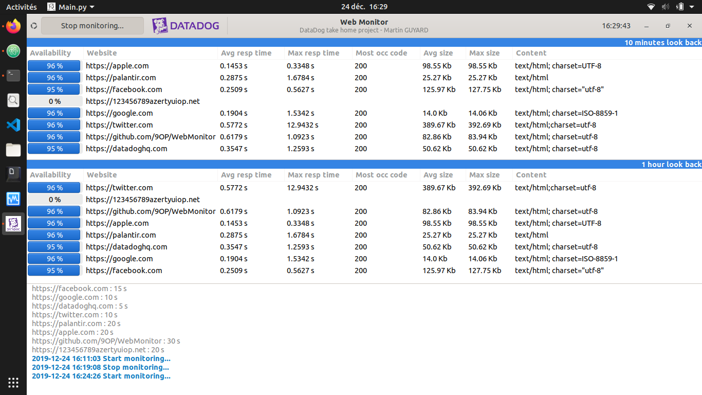

# WebMonitor

This is a python application that monitors websites and compute relevant
metrics such as availability rate, response time, status code occurence etc...

The project is developped in python and gtk.

websites.txt contains the sites to monitor, the format is:
```
https://example1.com, check_interval1(in seconds)
https://example2.com, check_interval2
https://example3.com, check_interval3
```

WebMonitor relies on Schedulers and thread and is based on a Producer-Consumer
design pattern.



**To do:**
- [X] Schedulers and MonitorMaster
- [X] Backend
- [X] UI
- [X] Watchers for alert and recover
- [ ] Tests for watchers and alert system
- [ ] Monitor on timeframe 2min and 10min => UI modification

### Installation
download the repo, install the dependancies, execute DDmonitor (sh script that call src/main.py)
